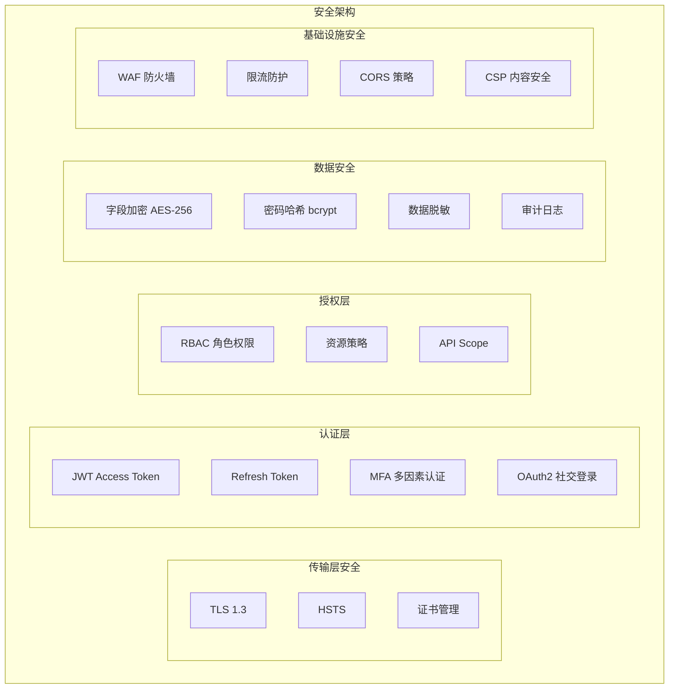
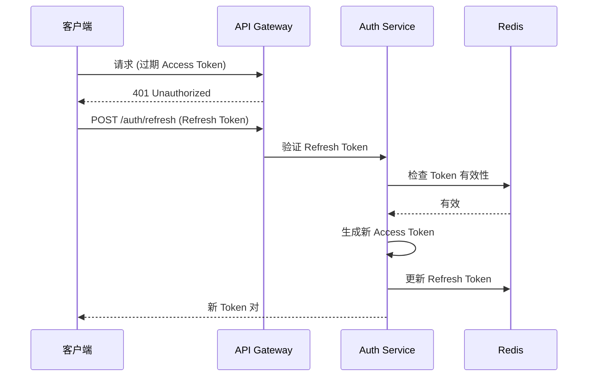
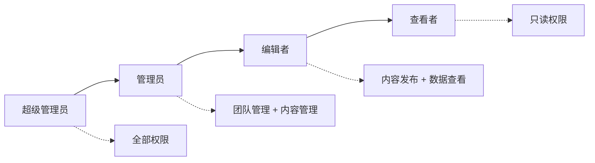

# MatrixFlow ERP - 安全架构设计

## 1. 安全架构总览



## 2. 认证设计 (Authentication)

### 2.1 JWT 双令牌机制

```
┌─────────────────────────────────────────────────┐
│                Token 生命周期                     │
├─────────────────────────────────────────────────┤
│                                                  │
│  Access Token (JWT)                              │
│  ├── 有效期: 15分钟                               │
│  ├── 存储: 内存 / httpOnly Cookie                │
│  ├── 载荷: userId, teamId, roles, permissions    │
│  └── 签名: RS256 (非对称加密)                     │
│                                                  │
│  Refresh Token                                   │
│  ├── 有效期: 7天                                  │
│  ├── 存储: httpOnly Cookie (Secure, SameSite)   │
│  ├── 存储: Redis (支持主动失效)                   │
│  └── 用途: 无感刷新 Access Token                 │
│                                                  │
└─────────────────────────────────────────────────┘
```

### 2.2 Token 刷新流程



### 2.3 密码安全策略

| 策略 | 规则 |
|------|------|
| 哈希算法 | bcrypt, cost factor = 12 |
| 最小长度 | 8 字符 |
| 复杂度 | 至少包含大写、小写、数字 |
| 错误锁定 | 连续5次失败锁定30分钟 |
| 历史检查 | 不可与最近3次密码相同 |
| 会话管理 | 单设备登录 / 可配置多设备 |

### 2.4 MFA 多因素认证

```yaml
# MFA 配置
mfa:
  enabled: true
  methods:
    - totp        # TOTP (Google Authenticator)
    - email_code  # 邮箱验证码
  backup_codes: 10  # 备用恢复码数量
  grace_period: 7d  # 新设备信任期
```

## 3. 授权设计 (Authorization)

### 3.1 RBAC 角色模型



### 3.2 权限矩阵

| 资源 / 操作 | 超级管理员 | 管理员 | 编辑者 | 查看者 |
|-------------|-----------|--------|--------|--------|
| 团队管理 | ✅ | ✅ | ❌ | ❌ |
| 成员管理 | ✅ | ✅ | ❌ | ❌ |
| 账号绑定 | ✅ | ✅ | ✅ | ❌ |
| 账号查看 | ✅ | ✅ | ✅ | ✅ |
| 内容发布 | ✅ | ✅ | ✅ | ❌ |
| 内容查看 | ✅ | ✅ | ✅ | ✅ |
| 数据统计 | ✅ | ✅ | ✅ | ✅ |
| 数据导出 | ✅ | ✅ | ✅ | ❌ |
| 审计日志 | ✅ | ✅ | ❌ | ❌ |
| 系统设置 | ✅ | ❌ | ❌ | ❌ |

### 3.3 资源级权限

```typescript
// 权限检查装饰器
@RequirePermission('account:write')
@TeamScope()
async bindAccount(@Body() dto: BindAccountDto) {
  // 仅当前团队的管理员/编辑者可绑定
}

// 权限定义
const PERMISSIONS = {
  // 账号管理
  'account:read':   '查看账号',
  'account:write':  '管理账号',
  'account:delete': '删除账号',

  // 内容发布
  'publish:read':   '查看发布',
  'publish:write':  '创建发布',
  'publish:cancel': '取消发布',

  // 数据统计
  'stats:read':     '查看统计',
  'stats:export':   '导出数据',

  // 团队管理
  'team:manage':    '管理团队',
  'member:manage':  '管理成员',
  'audit:read':     '查看日志',
} as const;
```

## 4. 数据安全

### 4.1 敏感数据加密

```yaml
# 加密策略
encryption:
  # 传输加密
  transport:
    protocol: TLS 1.3
    hsts_max_age: 31536000
    cert_provider: Let's Encrypt

  # 存储加密 - 平台凭据
  storage:
    algorithm: AES-256-GCM
    key_management: 环境变量 + K8s Secret
    encrypted_fields:
      - account.credentials
      - account.accessToken
      - account.refreshToken
      - user.mfaSecret

  # 数据库加密
  database:
    ssl_mode: require
    connection_encryption: true
```

### 4.2 数据脱敏规则

| 字段类型 | 脱敏规则 | 示例 |
|----------|----------|------|
| 手机号 | 中间4位 | 138****5678 |
| 邮箱 | 用户名部分 | z***@example.com |
| Token | 仅显示后4位 | ****abcd |
| 密码 | 完全隐藏 | ****** |
| IP地址 | 末段 | 192.168.1.* |

### 4.3 审计日志

```typescript
// 审计日志结构
interface AuditLog {
  id: string;
  timestamp: Date;
  userId: string;
  teamId: string;
  action: string;         // 'account.create' | 'publish.execute' | ...
  resource: string;       // 资源类型
  resourceId: string;     // 资源ID
  details: Record<string, any>;  // 操作详情
  ipAddress: string;
  userAgent: string;
  status: 'success' | 'failure';
}
```

## 5. 基础设施安全

### 5.1 网络安全

```yaml
# Nginx / Traefik 安全配置
security:
  # WAF 规则
  waf:
    - SQL注入防护
    - XSS防护
    - CSRF防护
    - 路径遍历防护

  # 限流策略
  rate_limiting:
    global: 1000 req/s
    per_ip: 100 req/min
    per_user: 300 req/min
    login: 5 req/min

  # CORS 配置
  cors:
    allowed_origins:
      - https://app.matrixflow.com
    allowed_methods: [GET, POST, PUT, PATCH, DELETE]
    allowed_headers: [Authorization, Content-Type]
    credentials: true
    max_age: 86400
```

### 5.2 CSP 内容安全策略

```
Content-Security-Policy:
  default-src 'self';
  script-src 'self' 'nonce-{random}';
  style-src 'self' 'unsafe-inline';
  img-src 'self' data: https:;
  connect-src 'self' wss://ws.matrixflow.com;
  frame-src 'none';
  object-src 'none';
  base-uri 'self';
  form-action 'self';
```

### 5.3 输入验证

```typescript
// DTO 验证 - 使用 class-validator
class CreatePublishDto {
  @IsString()
  @Length(1, 200)
  @Sanitize()  // 自定义消毒装饰器
  title: string;

  @IsString()
  @Length(1, 5000)
  @Sanitize()
  content: string;

  @IsEnum(Platform)
  platform: Platform;

  @IsArray()
  @IsUUID('4', { each: true })
  accountIds: string[];

  @IsOptional()
  @IsDateString()
  scheduledAt?: string;
}
```

## 6. 安全检查清单

### 部署前检查

- [ ] TLS 证书有效且配置正确
- [ ] 所有默认密码已更改
- [ ] 环境变量中无硬编码密钥
- [ ] 数据库连接使用 SSL
- [ ] CORS 配置限制为已知域名
- [ ] Rate Limiting 已启用
- [ ] CSP 头部已配置
- [ ] 审计日志功能正常
- [ ] 敏感字段加密验证通过
- [ ] 依赖包无已知高危漏洞 (npm audit)

### 运行时监控

- [ ] 异常登录检测（异地、新设备）
- [ ] API 异常调用告警
- [ ] Token 异常刷新告警
- [ ] 数据库慢查询告警
- [ ] 浏览器实例异常检测
