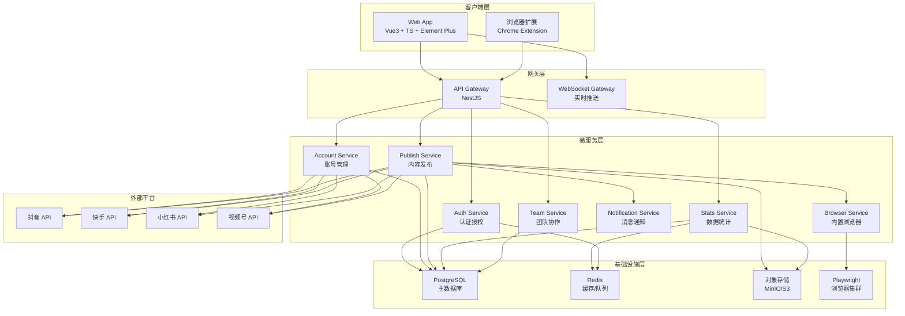
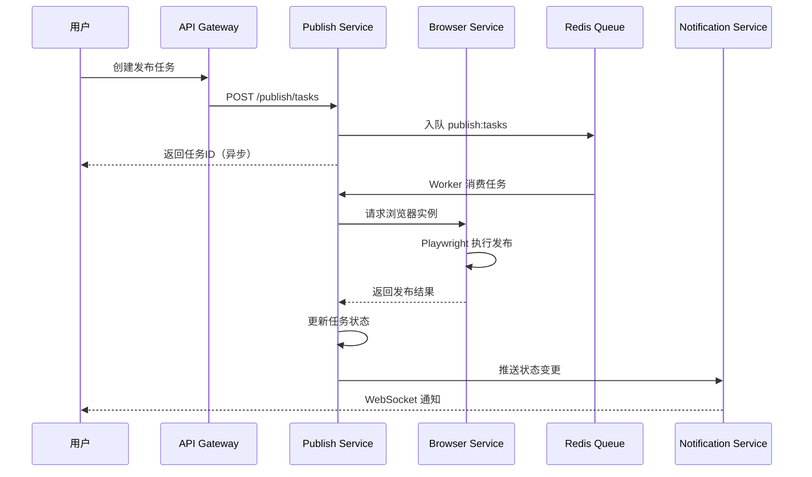
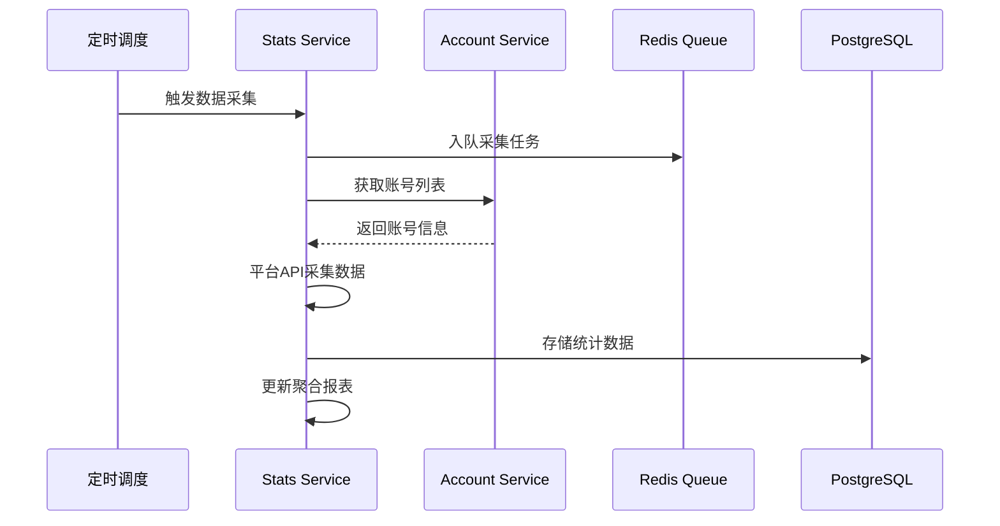

# MatrixFlow ERP - 系统架构设计

## 1. 架构概览

MatrixFlow ERP 采用**微服务架构 + 前后端分离**设计，面向5-20人团队提供矩阵账号管理、内置浏览器发布、数据统计和团队协作能力。

### 系统架构图



## 2. 技术栈

| 层级 | 技术 | 用途 |
|------|------|------|
| 前端 | Vue 3 + TypeScript + Element Plus | SPA 应用 |
| 前端状态 | Pinia | 状态管理 |
| 前端路由 | Vue Router 4 | 路由管理 |
| 后端框架 | NestJS (Node.js) | 微服务框架 |
| ORM | Prisma | 数据库访问 |
| 主数据库 | PostgreSQL 16 | 业务数据 |
| 缓存 | Redis 7 | 缓存/会话/消息队列 |
| 浏览器引擎 | Playwright | 内置浏览器/自动化 |
| 文件存储 | MinIO / S3 兼容 | 媒体文件 |
| 容器化 | Docker + Docker Compose | 开发环境 |
| 编排 | Kubernetes (K8s) | 生产部署 |
| CI/CD | GitHub Actions | 自动化流水线 |
| 反向代理 | Nginx / Traefik | 负载均衡/SSL |

## 3. 模块划分

### 3.1 认证服务 (Auth Service)
- 用户注册/登录
- JWT + Refresh Token 认证
- RBAC 权限管理
- OAuth2 第三方登录

### 3.2 账号管理服务 (Account Service)
- 多平台账号绑定/解绑
- 账号信息同步
- 账号分组管理
- 平台 Token 管理与续期

### 3.3 内容发布服务 (Publish Service)
- 发布任务队列管理
- 定时发布调度
- 多平台批量发布
- 发布状态跟踪
- 素材库管理

### 3.4 内置浏览器服务 (Browser Service)
- Playwright 浏览器实例池管理
- 浏览器隔离与会话管理
- 页面操作录制与回放
- Cookie/Session 持久化

### 3.5 数据统计服务 (Stats Service)
- 粉丝/播放/互动数据采集
- 数据报表生成
- 趋势分析
- 数据导出

### 3.6 团队协作服务 (Team Service)
- 团队/组织管理
- 成员角色权限
- 操作日志审计
- 审批工作流

### 3.7 消息通知服务 (Notification Service)
- 站内消息
- WebSocket 实时推送
- 邮件/短信通知（可选）

## 4. 服务间通信

| 通信方式 | 场景 | 协议 |
|----------|------|------|
| 同步 HTTP | API Gateway → 各微服务 | REST / JSON |
| 异步消息 | 发布任务、数据采集 | Redis Pub/Sub + BullMQ |
| WebSocket | 实时通知、浏览器状态 | WS / WSS |
| 共享数据库 | 跨服务数据查询（受限） | PostgreSQL |

### 消息队列设计

```
┌─────────────────────────────────────────────┐
│              Redis + BullMQ                  │
├─────────────────────────────────────────────┤
│  Queue: publish:tasks      → 发布任务        │
│  Queue: stats:collect      → 数据采集        │
│  Queue: browser:sessions   → 浏览器管理      │
│  Queue: notify:push        → 消息推送        │
│  Queue: account:sync       → 账号同步        │
└─────────────────────────────────────────────┘
```

## 5. 数据流

### 5.1 发布流程



### 5.2 数据采集流程



## 6. 项目目录结构

```
matrixflow-erp/
├── apps/
│   ├── web/                    # Vue3 前端
│   │   ├── src/
│   │   │   ├── api/            # API 调用层
│   │   │   ├── components/     # 通用组件
│   │   │   ├── composables/    # 组合式函数
│   │   │   ├── layouts/        # 布局组件
│   │   │   ├── router/         # 路由配置
│   │   │   ├── stores/         # Pinia 状态
│   │   │   ├── views/          # 页面视图
│   │   │   └── utils/          # 工具函数
│   │   └── ...
│   └── api/                    # NestJS 后端
│       ├── src/
│       │   ├── modules/
│       │   │   ├── auth/       # 认证模块
│       │   │   ├── account/    # 账号模块
│       │   │   ├── publish/    # 发布模块
│       │   │   ├── stats/      # 统计模块
│       │   │   ├── team/       # 团队模块
│       │   │   ├── browser/    # 浏览器模块
│       │   │   └── notify/     # 通知模块
│       │   ├── common/         # 公共模块
│       │   │   ├── guards/     # 守卫
│       │   │   ├── filters/    # 过滤器
│       │   │   ├── interceptors/ # 拦截器
│       │   │   └── decorators/ # 装饰器
│       │   └── prisma/         # Prisma 配置
│       └── ...
├── packages/
│   ├── shared/                 # 前后端共享类型
│   └── platform-sdk/           # 平台SDK封装
├── docker/                     # Docker 配置
│   ├── Dockerfile.web
│   ├── Dockerfile.api
│   └── docker-compose.yml
├── k8s/                        # K8s 部署配置
│   ├── base/
│   └── overlays/
├── docs/                       # 项目文档
└── scripts/                    # 脚本工具
```

## 7. 设计原则

1. **服务自治**：每个微服务独立部署、独立数据库 Schema
2. **API 优先**：先定义接口契约，再实现业务逻辑
3. **事件驱动**：服务间通过事件解耦，减少直接依赖
4. **安全隔离**：浏览器实例池隔离，账号数据加密存储
5. **水平扩展**：无状态服务设计，支持 K8s HPA 自动扩缩
6. **可观测性**：结构化日志 + 指标采集 + 链路追踪
