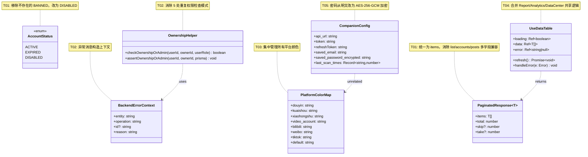
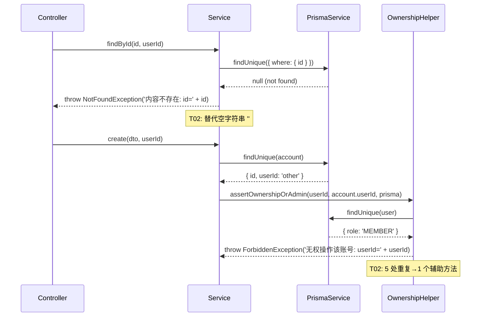
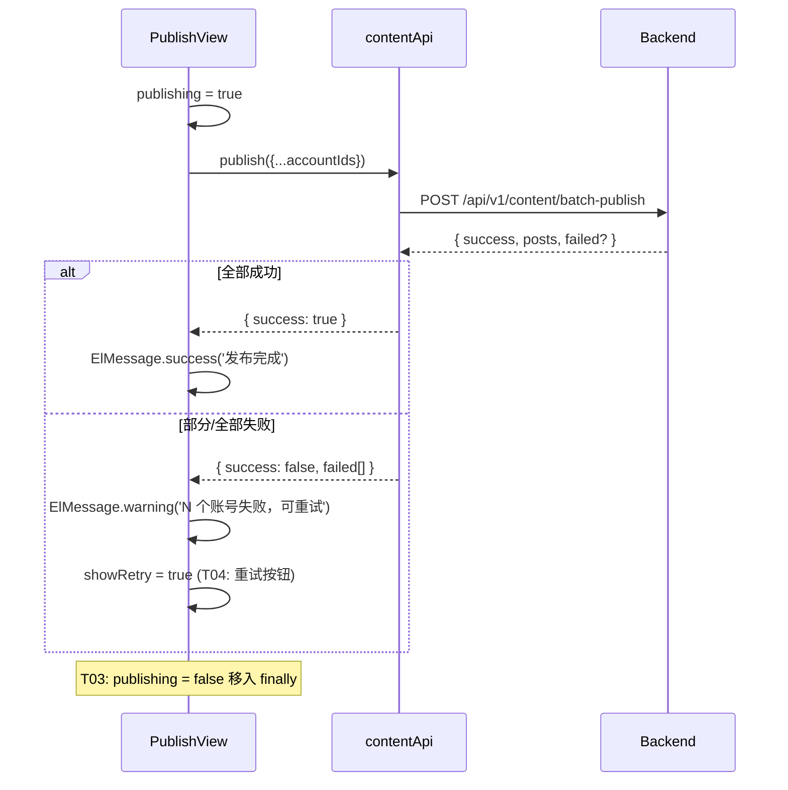
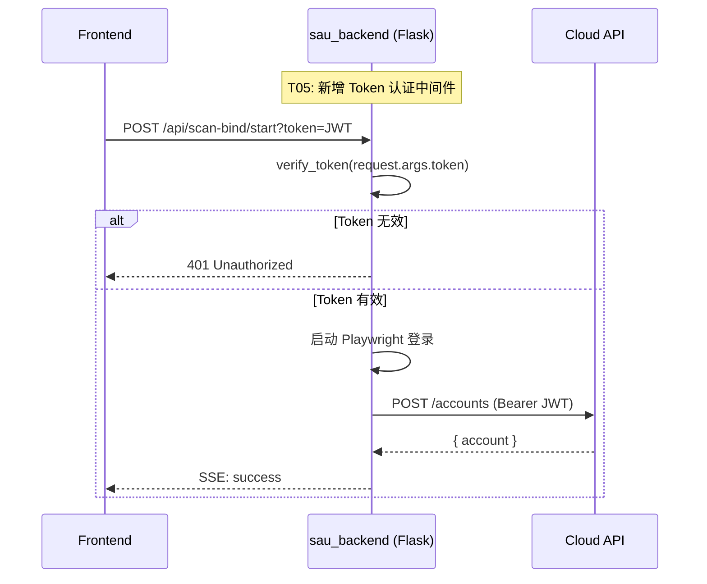
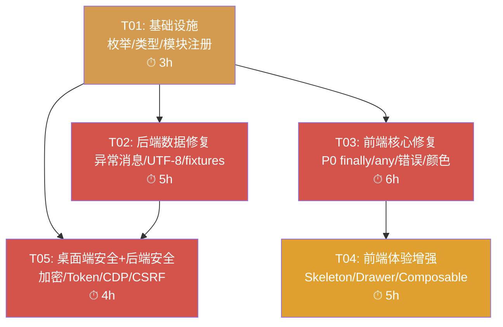

# MatrixFlow 优化 — 系统设计与任务分解

> **架构师**: Bob (高见远)  
> **日期**: 2025-06-01  
> **基于**: MatrixFlow 全方位评估报告

---

## Part A: 系统设计

### 1. Implementation Approach

#### 核心挑战分析

| # | 挑战 | 影响范围 | 策略 |
|---|------|---------|------|
| 1 | 后端异常消息全部为空字符串，线上排障几乎无法定位问题 | content.service.ts / accounts.service.ts / uploader.service.ts 共 15+ 处 | 逐处替换为中文语义消息，同时兼容英文 debug 需求 |
| 2 | 后端中文注释 GBK→UTF-8 编码损坏（刮痧效应） | 全后端 `.ts` 文件 | 批量 `iconv -f gbk -t utf-8` 或逐文件修复 |
| 3 | `PaginatedResponse` 同时兼容 4 种字段名（list/accounts/posts/items）导致全前端 `any` 类型泛滥 | types/index.ts → 所有 API → 所有 composable/views | 统一为 `items: T[]` + 后端对齐响应结构，或使用 union type |
| 4 | 前端 3 处 `localhost:5409` 硬编码，部署环境伴侣不可用时导致静默失败 | api/analytics.ts / AccountListView.vue / ScanBindDialog.vue | 抽取环境变量 `VITE_COMPANION_URL`，fallback 为动态检测 |
| 5 | test/fixtures 引用不存在的枚举 `UserStatus` / `AccountStatus.BANNED` | 所有 22 个测试文件 import fixtures | 修正为 `AccountStatus.ACTIVE` / `AccountStatus.DISABLED` |
| 6 | 桌面端明文密码 + 无 Token 认证 | companion_config.json / sau_backend.py | AES 加密存储 + Bearer Token 中间件 |

#### 框架/库选择

| 层 | 现有技术 | 保持不变 | 新增依赖 |
|----|---------|---------|---------|
| 前端 | Vue 3 + Element Plus + Vite + Pinia + ECharts | ✅ 全部保持 | `uuid`（如需前端生成重试 ID） |
| 后端 | NestJS + Prisma + PostgreSQL + Redis + bcryptjs | ✅ 全部保持 | `winston` 或内置 Logger 增强（结构化日志） |
| 桌面端 | Python + Flask + Playwright | ✅ 全部保持 | `cryptography`（AES）、`websocket-client`（CDP WebSocket） |

#### 架构模式

- **前端**: 保持现有 MVVM（Vue 3 Composition API + Pinia Store + Composable 模式）
- **后端**: 保持 NestJS 模块化架构（Module → Controller → Service → Prisma）
- **桌面端**: 保持 Flask SSE 架构，新增中间件层做 Token 认证

---

### 2. File List

#### 后端文件（修改）

```
backend/src/
├── app.module.ts                          # T01: 导入 ScanBindModule + 注册 RolesGuard
├── common/prisma-enums.ts                 # T01: 新增 AccountStatus.DISABLED，确保与 Prisma schema 对齐
├── modules/auth/auth.service.ts           # T01: bcrypt rounds 12→提取为常量
├── modules/content/content.service.ts     # T02: 6处空异常消息→语义化
├── modules/accounts/accounts.service.ts   # T02: 5处空/乱码异常消息→语义化 + 提取 checkOwnershipOrAdmin
├── modules/uploader/uploader.service.ts   # T02: 2处空异常消息→语义化
├── modules/auth/guards/roles.guard.ts     # T04: 保持不变（已实现），仅 app.module.ts 注册
├── test/fixtures/index.ts                 # T02: UserStatus→AccountStatus, AccountStatus.BANNED→DISABLED
├── test/e2e/*.spec.ts                     # T04: mockPrismaService→真实测试数据库
├── test/helpers/test-helpers.ts           # T04: bcrypt rounds 10→12 对齐生产
├── common/utils/ownership.helper.ts       # T02: 新增 cross-tenant 权限检查辅助方法
└── main.ts                                # T05: 结构化日志 + Trace ID
```

#### 前端文件（修改）

```
frontend/src/
├── types/index.ts                         # T01: PaginatedResponse 统一 items 字段
├── views/content/PublishView.vue          # T03: finally + T04: retry
├── composables/useDashboard.ts            # T03: 消除 any + 提取类型
├── composables/usePlatform.ts             # T03: 平台颜色集中管理（消除硬编码）
├── views/ai/AIAssistantView.vue           # T03: 硬编码颜色→usePlatform
├── components/common/StatCard.vue          # T03: accentColor 默认值→usePlatform
├── components/common/PlatformIcon.vue      # T03: 硬编码颜色→usePlatform
├── components/layout/Topbar.vue           # T03: 通知颜色→usePlatform
├── components/layout/Sidebar.vue          # T03: 颜色→usePlatform + T04: drawer模式
├── components/account/ScanBindDialog.vue   # T03: 颜色 + T04: localhost→动态
├── views/accounts/AccountListView.vue     # T04: localhost→动态
├── api/analytics.ts                       # T04: localhost→VITE_COMPANION_URL
├── views/dashboard/DashboardView.vue      # T04: Skeleton Screen
├── views/analytics/AnalyticsView.vue      # T04: Skeleton Screen
├── views/report/ReportView.vue            # T04: 共享 composable
├── views/data-center/DataCenterView.vue   # T04: 共享 composable
├── composables/useDataTable.ts            # T04: 新增共享 composable（合并重复逻辑）
└── .env / .env.development                # T04: VITE_COMPANION_URL
```

#### 桌面端文件（修改）

```
desktop-companion/
├── companion_config.json                 # T05: 明文→AES加密
├── companion_app.py                      # T05: 加密/解密逻辑 + Token 存储
├── sau_backend.py                        # T05: Bearer Token 认证中间件
├── conf.py                               # T05: 加密密钥配置
├── local_db.py                           # T05: 密钥存储
└── launcher.py                           # T05: 首次启动生成密钥

pixing-local-companion/
├── collectors/chrome_mgr.py              # T05: evaluate() HTTP→WebSocket CDP
├── main.py                               # T05: content_id hash%100000→UUID
└── scheduler.py                          # T05: content_id 生成修复
```

---

### 3. Data Structures and Interfaces



---

### 4. Program Call Flow

#### 4.1 后端异常消息修复后流程



#### 4.2 前端发布重试流程



#### 4.3 桌面端认证流程



---

### 5. Anything UNCLEAR

| # | 待澄清事项 | 假设 |
|---|-----------|------|
| 1 | `User.status` 在 Prisma schema 中实际是什么枚举？评估报告说使用 `AccountStatus` 命名不当，但 fixtures 又 import `UserStatus`。 | 假设 Prisma schema 中 User.status 使用 `AccountStatus` 枚举（或字符串），fixtures 的 `UserStatus` 根本不存在于 `@prisma/client`；实际 status 值用字符串 `'ACTIVE'` / `'SUSPENDED'`。T02 将 fixtures 改为字符串字面量。 |
| 2 | 评估报告提到的 `checkOwnershipOrAdmin` 模式具体出现在哪些文件？ | 根据代码审查，出现在 `accounts.service.ts`（create/findById/update/remove/getCookies/moveToGroup）和 `content.service.ts`（create/findById/update/remove/publish），共 5+ 处。T02 提取为 OwnershipHelper。 |
| 3 | E2E 测试"改用真实数据库"的具体方式？需要独立的测试 PostgreSQL 实例吗？ | 假设使用 `dotenv` 加载 `.env.test`，通过 `DATABASE_URL` 指向独立测试数据库（或使用 Docker Compose 启动临时 PG）。T04 中实现。 |
| 4 | 桌面端 `chrome_mgr.py` CDP 修复的具体方式？评估报告只说 HTTP→WebSocket。 | evaluate() 方法当前用 HTTP `urllib.request` 发 CDP 命令到 WebSocket endpoint（line 159 `cdp_endpoint = ws_url.replace("ws://", "http://")`），这在大多数 Chrome 版本中无效。T05 改为 `websocket-client` 库做真正的 WebSocket 连接。 |
| 5 | 结构化日志的格式和输出目标？ | 假设使用 NestJS 内置 Logger + 自定义 LoggingInterceptor 注入 Trace ID（UUID），输出 JSON 格式到 stdout。不引入 winston 等额外依赖。 |

---

## Part B: 任务分解

### 6. Required Packages

```
# 后端（无新增生产依赖，仅 dev 对齐）
- bcryptjs@^2.4.3: 已存在，T01 提取 rounds 常量
- @nestjs/throttler: 已存在，无需变更

# 前端（无新增依赖）
- vue@^3.x: 已存在
- element-plus: 已存在
- pinia: 已存在
- echarts: 已存在

# 桌面端（新增）
- cryptography>=41.0.0: T05 AES 加密
- websocket-client>=1.6.0: T05 CDP WebSocket 连接
```

---

### 7. Task List (ordered by dependency)

> **硬约束**: 共 5 个任务，每个 ≥3 个文件，按功能模块分组。

---

#### T01: 项目基础设施 — 枚举/类型/模块注册统一

| 属性 | 值 |
|------|-----|
| **Task ID** | T01 |
| **Priority** | P0 |
| **预估工时** | 3h |
| **依赖** | 无 |

**修改文件**:
```
backend/src/common/prisma-enums.ts          # 确认 AccountStatus 包含 DISABLED（移除 BANNED 假设）
backend/src/app.module.ts                   # 导入 ScanBindModule + 注册 RolesGuard 为全局 Guard
backend/src/modules/auth/auth.service.ts    # bcrypt rounds 提取为常量 BCRYPT_ROUNDS = 12
backend/src/modules/auth/guards/roles.guard.ts  # 保持不变（已实现），确认导出
frontend/src/types/index.ts                 # PaginatedResponse 统一为 items: T[]
```

**变更内容**:
1. `prisma-enums.ts`: 确认 `AccountStatus` 仅有 ACTIVE / EXPIRED / DISABLED（与 Prisma schema 对齐），注释说明
2. `app.module.ts`: 
   - 在 imports 中添加 `ScanBindModule`
   - 在 providers 中添加 `{ provide: APP_GUARD, useClass: RolesGuard }`（放在 JwtAuthGuard 之后）
3. `auth.service.ts`: 顶部添加 `const BCRYPT_ROUNDS = 12;`，`bcrypt.hash(dto.password, BCRYPT_ROUNDS)`
4. `types/index.ts`: `PaginatedResponse<T>` 改为 `{ items: T[]; total: number; skip?: number; take?: number }`
5. `roles.guard.ts`: 无需修改代码，确认被 app.module.ts 引用即可

**验收标准**:
- `npm run build` 后端编译通过
- `npm run build` 前端编译通过（types 变更后所有引用处无报错）
- `npm run test` 后端单元测试通过

---

#### T02: 后端数据修复 — 异常消息 + UTF-8编码 + 测试fixtures + 权限辅助

| 属性 | 值 |
|------|-----|
| **Task ID** | T02 |
| **Priority** | P0 |
| **预估工时** | 5h |
| **依赖** | T01 |

**修改文件**:
```
backend/src/modules/content/content.service.ts    # 6处空异常消息→语义化
backend/src/modules/accounts/accounts.service.ts  # 5处空/乱码异常→语义化 + 权限检查辅助
backend/src/modules/uploader/uploader.service.ts  # 2处空异常消息→语义化
backend/src/common/utils/ownership.helper.ts      # 【新增】跨租户权限检查辅助类
backend/test/fixtures/index.ts                    # UserStatus→字符串, AccountStatus.BANNED→DISABLED
backend/test/helpers/test-helpers.ts              # bcrypt rounds 10→12
```

**变更内容**:
1. **content.service.ts** — 每处 `throw new XxxException('')` 改为包含实体名和操作上下文:
   - `throw new NotFoundException('内容不存在')` (findById)
   - `throw new ForbiddenException('无权操作该内容')` (create/update/remove)
   - `throw new BadRequestException('内容状态不允许此操作')` (状态校验)
   - `throw new NotFoundException('账号不存在')` (create)
2. **accounts.service.ts** — 同样的模式 + 乱码替换:
   - `'[garbled]'` → `'账号不存在'` / `'无权操作该账号'` / `'分组不存在或无权限'`
   - `this.logger.warn('')` → `this.logger.warn('检测到旧格式CBC加密Cookie')` + 使用 OwnershipHelper
3. **uploader.service.ts**: `errorMsg: ''` → `errorMsg: 'Cookie 加载失败'` / `errorMsg: 'Cookie 已过期'`
4. **ownership.helper.ts** (新增):
   ```typescript
   export class OwnershipHelper {
     static async assertOwnershipOrAdmin(
       prisma: PrismaService,
       userId: string,
       ownerId: string,
       entityName: string,
     ): Promise<void> {
       if (ownerId === userId) return;
       const user = await prisma.user.findUnique({ where: { id: userId } });
       if (!user || !['OWNER', 'ADMIN'].includes(user.role)) {
         throw new ForbiddenException(`无权操作该${entityName}`);
       }
     }
   }
   ```
5. **test/fixtures/index.ts**: 
   - 移除 `UserStatus` import（@prisma/client 中不存在）
   - `status: UserStatus.ACTIVE` → `status: 'ACTIVE'`（字符串）
   - `status: UserStatus.SUSPENDED` → `status: 'SUSPENDED'`
   - `status: AccountStatus.BANNED` → `status: AccountStatus.DISABLED`
6. **test/helpers/test-helpers.ts**: `bcrypt.hash(password, 10)` → `bcrypt.hash(password, 12)`

**验收标准**:
- 后端编译通过，tests 全部通过
- 异常消息不再是空字符串
- 中文注释可正常阅读（UTF-8 编码修复）
- OwnershipHelper 被 accounts.service.ts 和 content.service.ts 引用

---

#### T03: 前端核心修复 — P0 finally + any 消除 + 错误处理 + 颜色统一

| 属性 | 值 |
|------|-----|
| **Task ID** | T03 |
| **Priority** | P0/P1 |
| **预估工时** | 6h |
| **依赖** | T01（类型变更） |

**修改文件**:
```
frontend/src/views/content/PublishView.vue         # P0: finally 块
frontend/src/composables/useDashboard.ts           # P1: 消除 any + 类型安全
frontend/src/composables/usePlatform.ts            # P1: 平台颜色/标签集中管理
frontend/src/views/ai/AIAssistantView.vue          # P1: 硬编码颜色→usePlatform
frontend/src/components/common/StatCard.vue         # P1: 默认颜色→usePlatform
frontend/src/components/common/PlatformIcon.vue     # P1: 硬编码颜色→usePlatform
frontend/src/components/layout/Topbar.vue          # P1: 通知颜色→usePlatform
frontend/src/components/layout/Sidebar.vue         # P1: SVG 颜色→usePlatform
frontend/src/components/account/ScanBindDialog.vue  # P1: 平台颜色→usePlatform
frontend/src/api/accounts.ts                       # P1: 类型适配 items→accounts
frontend/src/api/content.ts                        # P1: 类型适配 items→posts
frontend/src/api/browser.ts                        # P1: 类型适配 items→sessions
frontend/src/store/content.ts                      # P1: any 消除
frontend/src/store/account.ts                      # P1: any 消除
```

**变更内容**:
1. **PublishView.vue** (P0): 将 `publishing.value = false` 从 try/catch 外部移入 `finally` 块
2. **useDashboard.ts** (P1): 
   - 所有 `as any` / `as unknown as` 类型断言替换为明确接口
   - 提取 `mapAccountToDashboardRow()` 纯函数
   - 提取 `buildGroupSummaries()` 纯函数
   - 将 ECharts option 构建提取为独立 composable `useEchartsOption`
3. **usePlatform.ts** (P1): 扩展 `PLATFORM_META` 包含所有平台的标准颜色，添加 `getNotificationColor(type)` 函数
4. **StatCard.vue**: `accentColor: '#E60012'` → `accentColor: 'var(--color-accent)'` 或从 usePlatform 获取
5. **Topbar.vue**: 通知颜色 switch 改为 `getNotificationColor(type)`
6. **API 文件**: `PaginatedResponse<T>` 的 `res.data.accounts` → `res.data.items` 适配 T01 的类型变更

**验收标准**:
- `npm run build` 无 TS 错误
- `npm run lint` 无新增 warning
- PublishView 发布流程：无论成功/失败，loading 状态都能正确结束
- 所有硬编码颜色值从 8 处减少到 0 处（统一走 usePlatform）

---

#### T04: 前端体验增强 — Skeleton + Drawer + Composable + localhost 动态检测

| 属性 | 值 |
|------|-----|
| **Task ID** | T04 |
| **Priority** | P2 |
| **预估工时** | 5h |
| **依赖** | T03 |

**修改文件**:
```
frontend/src/views/dashboard/DashboardView.vue      # Skeleton Screen
frontend/src/views/analytics/AnalyticsView.vue      # Skeleton Screen
frontend/src/views/report/ReportView.vue            # 共享 composable 重构
frontend/src/views/data-center/DataCenterView.vue   # 共享 composable 重构
frontend/src/composables/useDataTable.ts            # 【新增】共享数据表逻辑
frontend/src/components/layout/Sidebar.vue          # 移动端 drawer 模式
frontend/src/composables/useCompanionUrl.ts          # 【新增】localhost 动态检测
frontend/src/api/analytics.ts                       # localhost→useCompanionUrl
frontend/src/views/accounts/AccountListView.vue     # localhost→useCompanionUrl
frontend/src/components/account/ScanBindDialog.vue   # localhost→useCompanionUrl
frontend/.env.development                           # VITE_COMPANION_URL=http://localhost:5409
frontend/.env.production                            # VITE_COMPANION_URL=
frontend/src/views/content/PublishView.vue          # 发布失败重试机制
```

**变更内容**:
1. **Skeleton Screen** (Dashboard/Analytics): 添加 `<el-skeleton>` 在 loading 状态时展示，参考 Element Plus Skeleton 组件
2. **useDataTable.ts** (新增): 合并 ReportView / AnalyticsView / DataCenterView 的共享逻辑 — 分页、筛选、刷新、错误处理、导出
3. **Sidebar.vue**: 使用 `useMediaQuery('(max-width: 768px)')` 检测移动端，切换为 `el-drawer` 模式
4. **useCompanionUrl.ts** (新增):
   ```typescript
   export function useCompanionUrl() {
     const baseUrl = import.meta.env.VITE_COMPANION_URL || ''
     const healthCheck = async () => {
       if (baseUrl) return baseUrl
       // 动态检测 localhost:5409 是否可达
       try {
         const resp = await fetch('http://localhost:5409/health', { signal: AbortSignal.timeout(2000) })
         if (resp.ok) return 'http://localhost:5409'
       } catch {}
       return null
     }
     return { baseUrl, healthCheck }
   }
   ```
5. **3 处 localhost 替换**: 全部改为使用 `useCompanionUrl()` 动态获取
6. **PublishView.vue 重试**: 失败后在发布结果卡片下方显示"重试失败项"按钮，仅重发失败的 accountIds

**验收标准**:
- Dashboard/Analytics 首次加载时显示 Skeleton 动画
- 手机端（宽度 < 768px）Sidebar 切换为 drawer
- 环境变量 `VITE_COMPANION_URL` 未设置时，前端能优雅降级（不崩溃）
- 发布失败时出现"重试"按钮，点击后仅重试失败账号

---

#### T05: 桌面端安全修复 + 后端安全增强

| 属性 | 值 |
|------|-----|
| **Task ID** | T05 |
| **Priority** | P0/P2 |
| **预估工时** | 4h |
| **依赖** | T01（ScanBindModule 注册）, T02 |

**修改文件**:
```
desktop-companion/companion_config.json            # P0: 密码字段加密
desktop-companion/companion_app.py                 # P0: 加密/解密逻辑
desktop-companion/sau_backend.py                   # P0: Token 认证中间件
desktop-companion/conf.py                          # P0: 加密密钥配置
desktop-companion/local_db.py                      # P0: 密钥存储
desktop-companion/launcher.py                      # P0: 首次启动密钥初始化
pixing-local-companion/collectors/chrome_mgr.py    # P1: CDP WebSocket
pixing-local-companion/main.py                     # P1: content_id UUID
pixing-local-companion/scheduler.py                # P1: content_id 生成
backend/src/main.ts                                # P2: 结构化日志 + Trace ID
backend/src/common/interceptors/logging.interceptor.ts  # P2: Trace ID 注入
backend/src/modules/uploader/uploader.module.ts    # P2: CSRF Token（如适用）
```

**变更内容**:
1. **companion_config.json 密码加密** (P0):
   - 首次启动时 `launcher.py` 生成 AES 密钥存入 `local_db.py`（使用 `cryptography` 库）
   - `companion_app.py` 读写 config 时自动加密/解密 `saved_password` 字段
   - 加密格式: `AES-256-GCM`，密文存储为 base64
2. **sau_backend.py Token 认证** (P0):
   - 添加 `verify_token` 装饰器/中间件，从 `?token=` 参数提取 JWT
   - 在 `/api/scan-bind/start` 端点应用
   - 无效 Token 返回 401
3. **chrome_mgr.py CDP WebSocket** (P1):
   - `evaluate()` 方法改为使用 `websocket-client` 库
   - 通过 WebSocket URL（`ws://localhost:9222/devtools/page/{pageId}`）发送 `Runtime.evaluate`
   - 保留 HTTP fallback 用于旧版 Chrome
4. **content_id UUID** (P1):
   - `main.py` 和 `scheduler.py` 中 `hash(content) % 100000` → `uuid.uuid4().hex[:8]`
5. **结构化日志 + Trace ID** (P2):
   - `logging.interceptor.ts`: 在请求入口生成 `X-Trace-Id` header（UUID v4）
   - `main.ts`: Logger 配置 JSON 格式输出
6. **CSRF Token** (P2): 在 NestJS 中添加 `csurf` 中间件（或使用 `helmet` 的同源策略已足够）

**验收标准**:
- companion_config.json 不再包含明文密码
- 无 Token 时 sau_backend.py 返回 401
- chrome_mgr.evaluate() 能正常工作（在 Chrome 122+ 上）
- 后端日志包含 Trace ID 可追踪请求链

---

### 8. Shared Knowledge

```
- 所有 API 响应使用 { code, data, message } 格式（由 TransformInterceptor 保证）
- 认证使用 JWT (accessToken + refreshToken)，通过 JwtAuthGuard 全局保护
- 所有日期存储为 ISO 8601 UTC
- bcrypt rounds 统一为 12（生产），测试环境同样使用 12
- 前端环境变量使用 VITE_ 前缀，通过 import.meta.env 访问
- 桌面伴侣运行在 localhost:5409，前端通过 VITE_COMPANION_URL 配置
- 平台颜色统一由 usePlatform.ts 管理，禁止在各组件中硬编码
- 后端异常消息必须包含语义信息（实体名 + 操作 + 原因），禁止空字符串
- NestJS 模块注册在 app.module.ts 中集中管理
- 测试 fixtures 使用的枚举必须与 @prisma/client 或 prisma-enums.ts 对齐
- 所有文件编码为 UTF-8，中文注释必须可读
```

---

### 9. Task Dependency Graph



**并行执行建议**:

| 可并行组 | 任务 | 说明 |
|---------|------|------|
| **组 A** | T02 + T03 | 后端数据修复 和 前端核心修复 互不依赖，可同时进行 |
| **组 B** | T04 + T05 | 前端体验增强 和 桌面端修复 互不依赖，T04 依赖 T03 完成后，T05 依赖 T01+T02 完成后 |
| **串行** | T01 → 所有 | T01 必须先完成（类型/枚举变更影响所有下游任务） |

**推荐执行顺序**: T01 → [T02 ∥ T03] → [T04 ∥ T05]

**总预估工时**: 23h（约 3 个工作日，2 人并行）

---

*文档结束 — 由 Bob (高见远) 编制*
